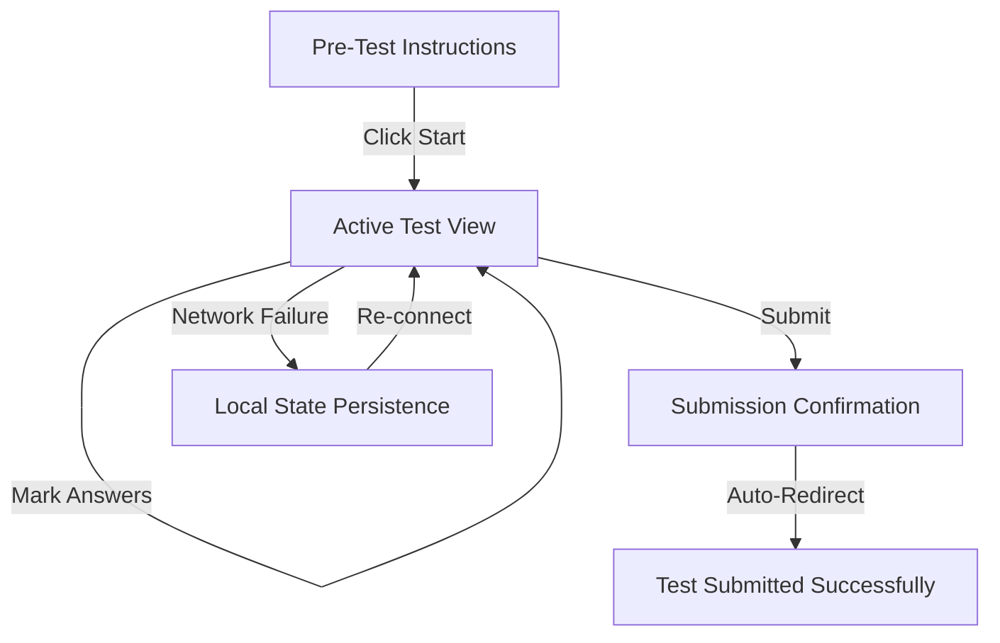

# Frontend Testing Product Requirements Document (PRD)

## 1. Project Overview
This project is a comprehensive Management and Assessment platform. The frontend is built using React and Vite, featuring a complex routing system for students, administrators, and system-level operations.

## 2. Testing Objectives
- Ensure a seamless and bug-free user experience across all modules.
- Validate role-based access control (RBAC) across the application.
- Guarantee the integrity of the assessment flow (Pre-test, Active Test, Submission).
- verify responsive design across various device types.
- Ensure data consistency when uploading bulk users or creating tests via wizards.

## 3. User Personas
### 3.1 Student
- **Actions**: Login, view dashboard, take tests, view results, access resources, manage profile.
### 3.2 Administrator
- **Actions**: Login, manage users, create tests, view admin-level results, system settings, bulk uploads.

## 4. Feature-Specific Testing Requirements

### 4.1 Authentication & Authorization
- **Login Flow**: Validate successful login, incorrect credentials, and "Forgot Password" functionality.
- **RBAC**: Ensure students cannot access `/admin/*` or `/management` routes.
- **Session Management**: Test "Session Expired" and "Force Password Change" flows.

### 4.2 Core Navigation (Layout)
- **Sidebar & Header**: Verify navigation links lead to correct routes.
- **Responsive Layout**: Test the `Layout` component's responsiveness on mobile, tablet, and desktop.

### 4.3 Assessment Hub Flow (Critical)
- **Pre-Test Instructions**: Verify instructions load correctly.
- **Active Test**:
    - Validate timer functionality (if applicable).
    - Ensure answers are saved and persisted.
    - Test edge cases: Loss of connectivity, browser refresh.
- **Submission**: Confirm successful submission UI and redirection to `/assessments/submitted`.

### 4.4 Admin Functions
- **Create Test Wizard**: Validate multi-step form data persistence and submission.
- **Bulk User Upload**: Test CSV/Excel file validation and error handling for malformed data.
- **System Settings**: Verify changes reflect immediately or after save.

### 4.5 Results & Analytics
- **Student Results**: Verify accurate display of individual performance.
- **Admin Results**: Ensure data aggregation and filtering (by class, date, etc.) work correctly.

## 5. Assessment Hub Flow Diagram

## 6. Key Feature Test Cases

| Feature | Test Scenario | Expected Result | Priority |
| :--- | :--- | :--- | :--- |
| **Login** | Enter invalid credentials | Display "Invalid credentials" error message | High |
| **RBAC** | Student attempts to visit `/admin` | Redirect to `/system/403` Access Denied | High |
| **Test Wizard** | Complete all 3 steps of wizard | Successful creation and redirect to Test List | High |
| **Active Test** | Refresh browser during test | State is restored from LocalStorage/Session | Critical |
| **Bulk Upload** | Upload 100+ users via CSV | Users are processed and validation report is shown | Medium |
| **Settings** | Toggle "Dark Mode" | Global theme changes immediately | Low |

## 7. Testing Strategy

### 7.1 Unit Testing
- **Tool**: Vitest / React Testing Library.
- **Scope**: Individual components (buttons, inputs, cards) and utility functions.

### 7.2 Integration Testing
- **Scope**: Complex components like `CreateTestWizard`, `ActiveTest`, and the `Layout` component's interaction with the `Router`.

### 7.3 End-to-End (E2E) Testing
- **Tool**: Playwright or Cypress.
- **Scenarios**:
    - **Student Journey**: Login -> Dashboard -> Take Test -> Submit -> View Results.
    - **Admin Journey**: Login -> Create Test -> Bulk Upload Users -> View Global Results.

## 8. Performance & UI Standards
- **Lighthouse Scores**: Minimum 90 in Performance, Accessibility, Best Practices, and SEO.
- **Browser Compatibility**: Support for Chrome, Firefox, Safari, and Edge.
- **Error Handling**: Custom `NotFound` (404) and `AccessDenied` (403) screens must display appropriate messages.

## 9. Success Metrics
- 100% pass rate for critical E2E flows.
- >80% code coverage for core business logic.
- Zero "Critical" or "High" severity bugs in production.
