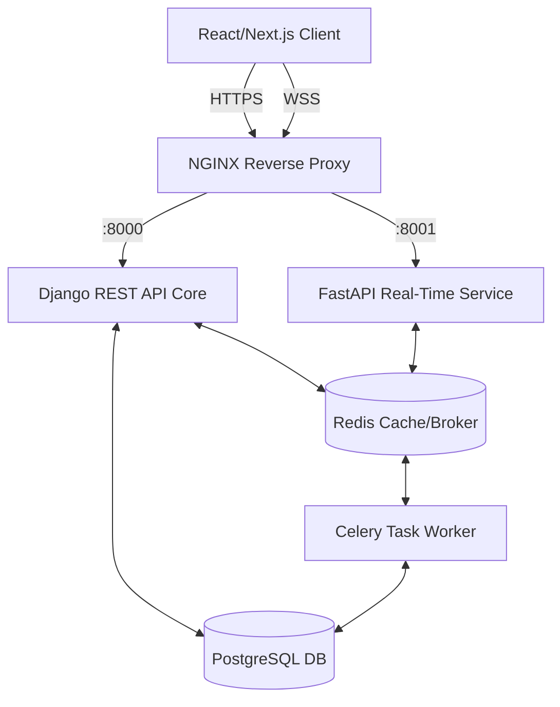

# SARAS Backend Architecture & Detailed Workflows

The **Smart Academic Resource and Secure Assessment System (SARAS)** backend is a hybrid, privacy-first architecture consisting of three main runtime components: a **Django REST API** for standard HTTP requests, a standalone **FastAPI Microservice** for scalable real-time WebSockets, and **Celery Workers** for deferred background processing.

Below is an in-depth breakdown of the primary workflows powering the platform.

---

## 1. System Architecture Overview

---

## 2. Core Workflows in Detail

### A. Authentication & Access Workflow
SARAS utilizes standard JSON Web Tokens (JWT) through Django Rest Framework (DRF), but enforces institutional security policies rigorously.

1. **Login Request:** Client posts credentials to `/api/auth/login/`.
2. **Audit Logging:** The `LoginAuditMiddleware` logs the attempt (success/failure) capturing IP address and user-agent into the `LoginAuditLog` table.
3. **First-Login Intercept:** 
   * If a user is freshly created (i.e., imported via CSV), their `force_password_change` flag lies as `True`. 
   * The login payload includes `{"force_password_change": true}`. The frontend is required to freeze usage and redirect to `/change-password/`.
4. **Token Handling:** Both the Access and Refresh tokens are returned. JWT tokens have strict lifetimes (e.g., Access = 60 mins). Tokens injected onto requests validate against `USER_ID` checks on every route.

### B. Secure Document Delivery (Anti-Screenshot Flow)
SARAS ensures documents cannot be trivially cached, downloaded, or screenshot securely without applying the dynamic "Snapchat Style" forensic workflow.

1. **Request:** Student hits `/api/documents/{id}/serve/` with headers including an active JWT.
2. **Authorization Layer:**
    * Django parses the token, checks the user’s `StudentProfile` to ensure they are assigned to the correct `Section` linked to the Document.
    * The view generates a local view-record inside the `document_views` table (tracking viewer, IP, and time).
3. **Watermarking Engine (`PyMuPDF`):**
    * Django extracts the raw PDF Binary (`BYTEA` column representing max 2MB raw data from PostgreSQL).
    * `PyMuPDF` natively injects a distinct watermark layer ("*Viewed By: User Name (Roll No) at Time*").
4. **Hardened HTTP Response:**
    * Django streams the bytes directly inline (`Content-Disposition: inline`).
    * Imposes maximum security headers to prevent browser caching: `Cache-Control: no-store`, `Pragma: no-cache`.
    * Imposes strict CSP headers ensuring no client-side scripts can interface with the inline `<embed>`/`<iframe>`.

### C. Live Assessment & Proctoring Workflow
This relies heavily on both the Django HTTP layer and the asynchronous FastAPI/Redis layers.

1. **Start Test (`HTTP`):** 
    * Student posts to `/api/tests/{id}/start/`. 
    * Django sets the attempt as `IN_PROGRESS`, calculates `expires_at` based on `duration_minutes`. 
    * *CRITICAL:* Django registers an asynchronous Task `auto_submit_attempt_task` onto Celery with an Exact Time of Arrival (`ETA`) matching the test expiry time.
2. **Socket Initialization (`WSS`):**
    * Student opens a websocket `/ws/test/{attempt_id}/?token={jwt}` to FastAPI.
    * FastAPI parses PyJWT tokens independently (sharing secret configuration), saving a DB-hit.
    * Redis binds the connection to a live channel `saras:timer:{attempt_id}`.
3. **Anomalous Behavioral Tracking:**
    * If the student triggers anti-cheat metrics (like `tab_switch` or `fullscreen_exit`), an event `json` is piped through the open socket to FastAPI.
    * FastAPI broadcasts these infractions via `redis.publish` instantly out to `saras:proctor_channel:global`.
    * Listening Teacher Dashboards (connected to `/ws/proctor/`) display instantaneous popup alerts regarding the Student's behavior.
4. **Async Auto-Submit:**
    * If the student finishes, they `POST /attempt/submit/`, grading executes synchronously, and we revoke the Celery task.
    * **If time runs out:** Celery natively springs alive, triggers `auto_submit_attempt`. It tallies the existing DB answers over standard rules, grades it, logs `AUTO_SUBMITTED`, and fires a WebSocket closure event to freeze the student's browser remotely.

### D. Bulk Institutional Import Workflow
Administrators add hundreds of teachers manually. Processing synchronously would freeze the API.

1. **Upload Request:** Admin `POST /api/users/bulk-upload/` attaching a single `.csv` file. 
2. **Deferred Work:** Django checks basic formatting and instantiates a `BulkImportJob` database entity setting its status to `QUEUED`. Endpoint safely returns the `job_id` (202 Accepted) immediately.
3. **Queue Execution:**
    * Celery worker strips off the top task: `process_bulk_import`.
    * Utilizing atomic blocks (`transaction.atomic`), rows are read explicitly ensuring zero partial db corruption. Students or Teachers are verified recursively.
4. **Notifications:**
    * Freshly crafted user accounts trigger an independent dispatch task `send_notification_email` to silently handle SMTP connections.
5. **Job Wrap:**
    * The `BulkImportJob` entity applies metrics: `success_rows`, `error_rows`, `error_report[json]`. Endpoints tracking status finally yield `COMPLETED`.

---

## 3. Persistent Data Handling 

* **Soft Deletes:** No core records (`Test`, `Document`, `User`) are ever permanently `DELETE`d. Actions instead toggle `is_deleted = False -> True` accompanied by a `deleted_at` timestamp enabling recovery and tracking reference integrity.
* **BRIN & Indexing:** Tables recording high-throughput event metrics — particularly the `behavioral_events` array tracking mouse movements or clicks per test — leverage specialized database indexing (e.g., BRIN blocks over timestamps) to ensure millions of rows scale efficiently.
* **No Local Filesystem:** Documents dodge filesystem management issues by residing permanently wrapped as `BYTEA` structures inside PostgreSQL. This inherently caps complex permission flaws. Scale-out strategies purely involve vertical database improvements. 
